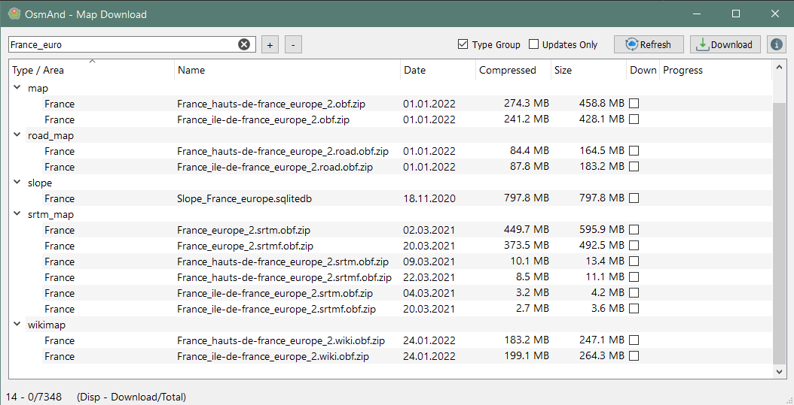

# OsmAnd Maps downloader (CLI &amp; GUI)

OsmAnd Android application has a free version with a limitation on maps updates.

This repo was created for two Proofs of Concept, one **Graphical** application and one **Command 
line** application to define a set of map and feed the latest updates available. Those maps
downloaded maps could be copied into your smartphone over ADB or any network share.

## Summary

- [OsmAnd Maps downloader (CLI &amp; GUI)](#osmand-maps-downloader--cli--amp--gui-)
  * [Usage](#usage)
    + [Graphical User Interface](#graphical-user-interface)
    + [Command Line Interface](#command-line-interface)
  * [HowTo](#howto)
    + [Prepare env](#prepare-env)
    + [Build](#build)
      - [GUI](#gui)
    + [Create native executable](#create-native-executable)

## Usage

### Graphical User Interface


### Command Line Interface
````
Usage: osmm_cli.py [OPTIONS] COMMAND [ARGS]...

Options:
  --version                      Show the version and exit.
  -cd, --cache-dir DIRECTORY     Path where to find cache files
  -dd, --download-dir DIRECTORY  Path where to download and extract assets
  --help                         Show this message and exit.

Commands:
  list     List assets available in cache
  refresh  Refresh cache from OpenStreet Map server
  update   Download/Update assets based on watch list
  watch    Watch list management
````

This command line interface allows three basic operation :
1) Listing assets available on server 
````
Usage: osmm_cli.py list [OPTIONS]

  List assets available in cache

Options:
  -c, --cache                   Use cached file rather than online server
  -l, --list [ALL|AREAS|TYPES]  List assets available
  -t, --type TEXT               List only assets part of this type
  -a, --area TEXT               List only assets part of this area
  -d, --date TEXT               Retrieve date update for specified asset
  -s, --sort [name|size|date]   Order to use for list display
  --help                        Show this message and exit.
````
2) Handling watch list 
````
Usage: osmm_cli.py watch [OPTIONS]

  Watch list management

Options:
  -l, --list      List all assets to watch
  -c, --clear     Remove all assets from watch list
  -a, --add TEXT  Add specified asset to watch list
  -d, --del TEXT  Remove specified asset from watch list
  --help          Show this message and exit.
````
3) Pulling updates available
````
Usage: osmm_cli.py update [OPTIONS]

  Download/Update assets based on watch list

Options:
  -n, --no-progress  Disable progress bar during download
  --help             Show this message and exit.
````

Last but not least, there are some tricks to
  * Use cd dlocal cache
  
## HowTo

### Prepare env

Prepare a Vitrual environment for your project and install requirements
```
$ python -m venv venv
```

Switch to your venv 
* on linux `$ source venv/bin/activate`
* on Windows `$ .\venv\Scripts\activate.bat`

Install dependencies
```
$ python -m pip install -r requirements_cli.txt
$ python -m pip install -r requirements_gui.txt
```

### Build

#### GUI
Before launching the application, you must build UIs and Resource file with the following commands
##### Generate UIs
	$ pyuic5 gui/main.ui -o gui/main.py
	$ pyuic5 gui/about.ui -o gui/about.py

##### Generate Res file
	$ pyrcc5 osmm_res.qrc -o osmm_res_rc.py


### Create native executable

In order to create a native executable (easier to deploy), you should proceed as following :

1. Install dependencies `$ python -m pip install pyinstaller`
2. Generate self contained binary


#### CLI
```
$ pyinstaller osmm_cli.spec
...
$ dist\osmm_cli.exe
```

#### GUI
```
$ pyinstaller osmm_gui.spec
...
$ dist\osmm_gui.exe
```