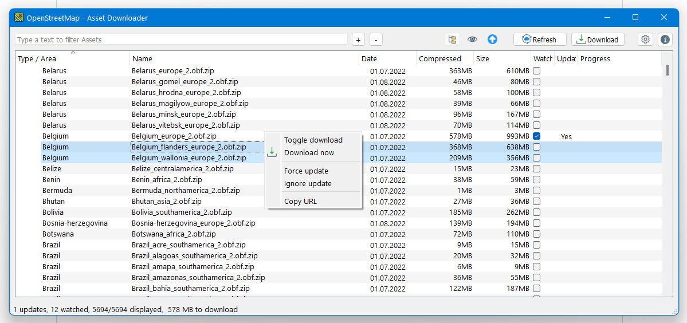

# Open Street Map - Assets Downloader (CLI &amp; GUI)

OsmAnd Android application has a free version with a limitation on maps updates.

This repo was created for two Proofs of Concept, one **Graphical** application and one **Command 
line** application to define a set of map and feed the latest updates available. Those maps
downloaded maps could be copied into your smartphone over ADB or any network share.

## Summary
- [Open Street Map - Assets Downloader (CLI &amp; GUI)](#open-street-map---assets-downloader--cli--amp--gui-)
  * [Summary](#summary)
  * [Usage](#usage)
    + [Graphical User Interface](#graphical-user-interface)
    + [Command Line Interface](#command-line-interface)
  * [HowTo](#howto)
    + [Prepare env](#prepare-env)
    + [Build](#build)
      - [GUI](#gui)
    + [Create native executable](#create-native-executable)

## Usage

### Graphical User Interface
* About<br/>
  


* Main Screen on Windows<br/>



* Downloading on Linux<br/>


* Settings<br/>
  
  


### Command Line Interface
````
Usage: osmad_cli.py [OPTIONS] COMMAND [ARGS]...

Options:
  --version                     Show the version and exit.
  -ad, --asset-dir DIRECTORY    Path where to download assets
                                (value saved in config file)
  -ed, --extract-dir DIRECTORY  Path where to extract assets 
                                (value saved in config file)
  --help                        Show this message and exit.

Commands:
  get      Direct Download of assets based on filters
  list     List assets available in cache
  refresh  Refresh cache from OpenStreet Map server
  update   Download/Update assets based on watch list
  watch    Watch list management
````

This command line interface allows three basic operation for cron job:
1) Listing assets available on server 
````
Usage: osmad_cli.py list [OPTIONS]

  List assets available in cache

Options:
  -c, --cache                   Use cached file rather than online server
  -l, --list [ALL|AREAS|TYPES]  List assets available
  -t, --type TEXT               List only assets part of this type
  -a, --area TEXT               List only assets part of this area
  -d, --date TEXT               Retrieve date update for specified asset
  -s, --sort [name|size|date]   Order to use for list display
  --help                        Show this message and exit.
````
2) Handling watch list 
````
Usage: osmad_cli.py watch [OPTIONS]

  Watch list management

Options:
  -l, --list      List all assets to watch
  -c, --clear     Remove all assets from watch list
  -a, --add TEXT  Add specified asset to watch list
  -d, --del TEXT  Remove specified asset from watch list
  --help          Show this message and exit.
````
3) Pulling updates available
````
Usage: osmad_cli.py update [OPTIONS]

  Download/Update assets based on watch list

Options:
  -n, --no-progress  Disable progress bar during download
  -s, --silent       Silent update, display update found
  --help             Show this message and exit.
````

A supplementary command has been added to support direct download:
4) Direct download (no extraction)
```
Usage: osmad_cli.py get [OPTIONS]

  Direct Download of assets based on filters

Options:
  -y, --yes          Do not request for user approval
  -u, --url          Do not download, just display url
  -f, --filter TEXT  Apply some filters to get only one download  [required]
  --help             Show this message and exit.
```

## HowTo

### Prepare env

Prepare a Vitrual environment for your project and install requirements
```
$ python -m venv venv
```

Switch to your venv 
* on linux `$ source venv/bin/activate`
* on Windows `$ .\venv\Scripts\activate.bat`

Install dependencies
```
$ python -m pip install -r requirements_cli.txt
$ python -m pip install -r requirements_gui.txt
```

Using linux env, you might require deb packages to be installed
```
$ sudo apt install python3-pyqt5 pyqt5-dev-tools
```

### Build

#### GUI
Before launching the application, you must build UIs and Resource file with the following commands
##### Generate UIs
	$ pyuic5 src/ui/ui_main.ui -o src/ui/ui_main.py

##### Generate Res file
	$ pyrcc5 src/resources.qrc -o src/resources_rc.py


### Create native executable

In order to create a native executable (easier to deploy), you should proceed as following :

1. Install dependencies `$ python -m pip install pyinstaller`
2. Generate self-contained binaries


#### CLI
```
$ pyinstaller osmad_cli.spec
...
$ dist\osmad_cli.exe
```

#### GUI
```
$ pyinstaller osmad_gui.spec
...
$ dist\osmad_gui.exe
```